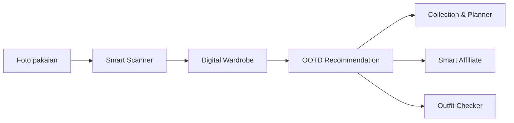

# GAYAKU

**Platform Rekomendasi Outfit Personal Berbasis Machine Learning untuk Berbagai Acara dan Semua Gender**

Proyek Project Based Learning (PBL) Semester 5, mata kuliah Pemrograman Mobile.
Program Studi D4 Teknik Informatika, Politeknik Negeri Malang. Kelas TI-3E, Kelompok 3.

---

## Daftar Isi

1. [Deskripsi Proyek](#deskripsi-proyek)
2. [Fitur](#fitur)
3. [Machine Learning dan Computer Vision](#machine-learning-dan-computer-vision)
4. [Teknologi](#teknologi)
5. [Desain Antarmuka](#desain-antarmuka)
6. [Istilah Domain](#istilah-domain)
7. [Pengujian](#pengujian)
8. [Menjalankan Aplikasi](#menjalankan-aplikasi)
9. [Unduh Aplikasi](#unduh-aplikasi)
10. [Struktur Repository](#struktur-repository)
11. [Anggota Kelompok](#anggota-kelompok)

---

## Deskripsi Proyek

GAYAKU adalah aplikasi mobile yang membantu pengguna mengelola pakaian yang dimiliki dan memperoleh rekomendasi outfit sesuai kebutuhan, preferensi, dan jenis acara.

Aplikasi memanfaatkan Machine Learning dan Computer Vision pada fitur Smart Scanner untuk mengubah foto pakaian menjadi data digital. Data tersebut disimpan di Digital Wardrobe dan digunakan sebagai dasar rekomendasi outfit.

GAYAKU ditujukan untuk semua gender dan mendukung empat jenis acara: formal, casual, smart casual, dan sport.

### Alur Penggunaan



---

## Fitur

### 1. Account & Profile

Mengelola akun dan informasi profil pengguna.

- Registrasi dan login pengguna
- Pengelolaan informasi profil
- Penyimpanan preferensi pengguna

### 2. Smart Scanner

Memasukkan pakaian ke Digital Wardrobe melalui gambar dengan bantuan Computer Vision dan Machine Learning.

- Mengambil atau memilih gambar pakaian
- Menghapus background pakaian menggunakan MediaPipe
- Mengklasifikasikan jenis pakaian menggunakan YOLOv8
- Mengekstraksi warna dominan pakaian menggunakan K-Means
- Mengoreksi informasi pakaian secara manual

Hasil pemrosesan digunakan sebagai informasi pakaian pada Digital Wardrobe.

### 3. Digital Wardrobe

Menyimpan dan mengelola pakaian pengguna secara digital.

- Menambahkan pakaian
- Menampilkan daftar pakaian
- Mengelompokkan pakaian berdasarkan kategori
- Menyimpan informasi pakaian
- Menggunakan pakaian dalam rekomendasi outfit

### 4. OOTD Recommendation / Mix & Match

Memberikan rekomendasi kombinasi outfit berdasarkan kebutuhan pengguna. Faktor yang dipertimbangkan:

- Jenis acara (formal, casual, smart casual, sport)
- Gaya berpakaian
- Kombinasi warna
- Kondisi cuaca
- Pakaian yang tersedia di Digital Wardrobe

### 5. Collection & Planner

Menyimpan outfit yang disukai dan membantu perencanaan outfit.

- Menyimpan outfit favorit
- Membuat koleksi outfit
- Merencanakan outfit untuk aktivitas atau acara tertentu

### 6. Smart Affiliate

Membantu pengguna menemukan produk yang belum tersedia di Digital Wardrobe untuk melengkapi rekomendasi outfit. Konsep utamanya adalah Missing Piece Detector, yaitu mendeteksi bagian outfit yang belum tersedia dan merekomendasikan produk yang sesuai.

- Mendeteksi kebutuhan pakaian yang belum tersedia
- Memberikan rekomendasi produk
- Menampilkan tautan produk dari partner

### 7. Outfit Checker

Membantu pengguna mengevaluasi kesesuaian outfit berdasarkan konteks dan gaya yang dipilih.

### 8. Admin Partner Catalog

Mengelola katalog produk partner yang digunakan pada Smart Affiliate.

- Menambahkan produk partner
- Mengubah informasi produk
- Menghapus produk
- Mengelola katalog produk

### Status Pengembangan

| Fitur | Status |
|---|---|
| Home / Dashboard (antarmuka) | Selesai, telah dijalankan di emulator |
| Account & Profile | Dalam pengembangan |
| Smart Scanner | Dalam pengembangan |
| Digital Wardrobe | Dalam pengembangan |
| OOTD Recommendation | Dalam pengembangan |
| Collection & Planner | Dalam pengembangan |
| Smart Affiliate | Dalam pengembangan |
| Outfit Checker | Dalam pengembangan |
| Admin Partner Catalog | Dalam pengembangan |

---

## Machine Learning dan Computer Vision

Smart Scanner memproses gambar pakaian dalam empat tahap.


| Tahap | Metode | Fungsi |
|---|---|---|
| Background Removal | MediaPipe | Memisahkan objek pakaian dari background gambar |
| Clothing Classification | YOLOv8 | Mengidentifikasi jenis atau kategori pakaian |
| Color Extraction | K-Means Clustering | Memperoleh warna dominan pakaian |
| Manual Correction | Input pengguna | Memperbaiki hasil bila deteksi tidak sesuai |

---

## Teknologi

| Teknologi | Kegunaan |
|---|---|
| Flutter | Pengembangan aplikasi mobile |
| Dart | Bahasa pemrograman |
| MediaPipe | Background removal |
| YOLOv8 | Klasifikasi pakaian |
| K-Means Clustering | Ekstraksi warna |
| Machine Learning | Rekomendasi dan pengolahan informasi pakaian |
| Computer Vision | Pengolahan gambar pakaian |
| Git dan GitHub | Version control dan kolaborasi tim |

---

## Desain Antarmuka

Antarmuka dirancang agar sederhana dan mudah dipahami. Seluruh mockup tersedia di folder [`design/`](design/).

| Halaman | Deskripsi |
|---|---|
| Home / Dashboard | Informasi utama pengguna, rekomendasi outfit, dan akses cepat ke fitur |
| Digital Wardrobe | Daftar pakaian yang telah disimpan pengguna |
| Smart Scanner | Input gambar pakaian dan hasil informasi pakaian |
| OOTD Recommendation | Rekomendasi outfit berdasarkan kebutuhan pengguna |
| Collection & Planner | Koleksi outfit dan perencanaan outfit |
| Outfit Checker | Evaluasi kesesuaian outfit |

### Tampilan Aplikasi

<!--
Sesuaikan nama file dengan isi folder design/ atau screenshot aplikasi,
lalu hapus pembuka dan penutup komentar HTML ini.

| Home | Digital Wardrobe | Smart Scanner |
|---|---|---|
|  |  |  |
-->

Screenshot aplikasi akan ditambahkan seiring penyelesaian setiap halaman.

---

## Istilah Domain

Istilah berikut digunakan secara konsisten dalam pengembangan dan tampilan aplikasi.

| Istilah | Definisi |
|---|---|
| Look | Rekomendasi outfit yang sudah dipadukan, berisi judul, subtitle, style tag, dan gambar. Ditampilkan kepada pengguna sebagai "Today's Look". Look merepresentasikan rekomendasi, sedangkan pakaian adalah item milik pengguna. |
| WardrobeItem | Satu pakaian milik pengguna, dengan informasi nama, kategori, dan gambar. Satu Look dapat menggunakan beberapa WardrobeItem, tetapi Look bukan WardrobeItem. |
| Style Tag | Label singkat gaya atau konteks suatu Look, misalnya Casual Chic, Formal, Smart Casual, dan Sporty. |
| QuickAction | Kartu pintasan yang mengarahkan pengguna ke fitur atau tujuan tertentu, misalnya Your Favorite dan Plan Week. Sebagian tujuan masih dalam tahap pengembangan. |
| Greeting | Sapaan berdasarkan waktu yang ditampilkan bersama nama pengguna, misalnya "Good Evening, Isabella". |

---

## Pengujian

Pengujian dilakukan untuk memastikan fungsi utama aplikasi berjalan sesuai kebutuhan. Kolom Status diperbarui setelah pengujian dilaksanakan.

### Functional Test Cases

| ID | Fitur | Skenario | Hasil yang Diharapkan | Status |
|---|---|---|---|---|
| TC-01 | Account & Profile | Pengguna membuka halaman profil | Informasi profil pengguna ditampilkan | Belum diuji |
| TC-02 | Account & Profile | Pengguna login dengan data yang valid | Pengguna berhasil masuk ke aplikasi | Belum diuji |
| TC-03 | Smart Scanner | Pengguna memilih gambar pakaian | Gambar pakaian berhasil diproses | Belum diuji |
| TC-04 | Smart Scanner | Sistem memproses gambar pakaian | Informasi pakaian dapat dihasilkan | Belum diuji |
| TC-05 | Digital Wardrobe | Pengguna menambahkan pakaian | Pakaian tersimpan di Digital Wardrobe | Belum diuji |
| TC-06 | Digital Wardrobe | Pengguna membuka Digital Wardrobe | Daftar pakaian ditampilkan | Belum diuji |
| TC-07 | OOTD Recommendation | Pengguna memilih jenis acara | Rekomendasi outfit ditampilkan | Belum diuji |
| TC-08 | OOTD Recommendation | Pengguna melihat rekomendasi outfit | Informasi outfit ditampilkan dengan benar | Belum diuji |
| TC-09 | Collection & Planner | Pengguna menyimpan outfit | Outfit tersimpan dalam koleksi | Belum diuji |
| TC-10 | Collection & Planner | Pengguna membuat rencana outfit | Rencana outfit berhasil dibuat | Belum diuji |
| TC-11 | Smart Affiliate | Sistem menemukan item yang belum tersedia | Produk yang relevan dapat direkomendasikan | Belum diuji |
| TC-12 | Smart Affiliate | Pengguna memilih produk | Tautan produk dapat diakses | Belum diuji |
| TC-13 | Outfit Checker | Pengguna melakukan pengecekan outfit | Hasil pengecekan ditampilkan | Belum diuji |
| TC-14 | Admin Partner Catalog | Admin menambahkan produk partner | Produk berhasil ditambahkan ke katalog | Belum diuji |
| TC-15 | Admin Partner Catalog | Admin mengubah informasi produk | Informasi produk berhasil diperbarui | Belum diuji |

### Computer Vision Testing

Mengevaluasi proses pada Smart Scanner.

| ID | Aspek | Hasil yang Diharapkan | Status |
|---|---|---|---|
| CV-01 | Background Removal | Background pakaian dapat dipisahkan dengan baik | Belum diuji |
| CV-02 | Clothing Classification | Jenis pakaian dikenali sesuai kategori | Belum diuji |
| CV-03 | Color Extraction | Warna dominan pakaian dapat diperoleh | Belum diuji |
| CV-04 | Manual Correction | Pengguna dapat memperbaiki hasil deteksi | Belum diuji |

### Recommendation Testing

Menguji kesesuaian rekomendasi outfit dengan kondisi yang diberikan pengguna. Hasil rekomendasi dibandingkan dengan kriteria outfit yang telah ditentukan, dengan mempertimbangkan:

- Jenis acara
- Gaya pakaian
- Kombinasi warna
- Kondisi cuaca
- Ketersediaan pakaian pada Digital Wardrobe

### Affiliate Link Testing

Memastikan rekomendasi produk dan tautan partner dapat digunakan dengan baik.

| ID | Aspek yang Diuji | Status |
|---|---|---|
| AF-01 | Produk yang direkomendasikan sesuai dengan kebutuhan outfit | Belum diuji |
| AF-02 | Informasi produk ditampilkan dengan benar | Belum diuji |
| AF-03 | Tautan produk dapat diakses | Belum diuji |
| AF-04 | Tautan mengarah ke produk atau halaman partner yang sesuai | Belum diuji |

---

## Menjalankan Aplikasi

### Prasyarat

- Flutter SDK dan Dart ([panduan instalasi](https://docs.flutter.dev/get-started/install))
- Android Studio atau Visual Studio Code dengan ekstensi Flutter
- Emulator Android atau perangkat Android fisik dengan USB debugging aktif
- Git

### Instalasi dan Eksekusi

```bash
git clone https://github.com/kmilaz/gayaku.git
cd gayaku/flutter_app
flutter pub get
flutter devices
flutter run -d <id-perangkat>
```

Jika terdapat kendala pada lingkungan pengembangan, jalankan `flutter doctor` untuk memeriksa konfigurasi.

### Menjalankan pada Perangkat Fisik

1. Aktifkan Developer options pada perangkat Android (Settings, About phone, ketuk Build number sebanyak tujuh kali).
2. Aktifkan USB debugging.
3. Hubungkan perangkat ke komputer dengan kabel USB dan izinkan debugging.
4. Jalankan `flutter run`.

### Build APK

```bash
cd flutter_app
flutter build apk --release
```

Berkas hasil build berada di `flutter_app/build/app/outputs/flutter-apk/app-release.apk`.

---

## Unduh Aplikasi

APK rilis tersedia pada halaman [Releases](https://github.com/kmilaz/gayaku/releases/latest).

Untuk memasang APK di luar Play Store, aktifkan izin instalasi dari sumber tidak dikenal pada perangkat Android.

---

## Struktur Repository

```text
gayaku/
├── README.md
├── design/            Mockup antarmuka
└── flutter_app/       Source code aplikasi Flutter
    ├── android/
    ├── ios/
    ├── lib/
    ├── test/
    └── pubspec.yaml
```

---

## Anggota Kelompok

Kelas TI-3E, Kelompok 3
D4 Teknik Informatika, Politeknik Negeri Malang

| No. | Nama | NIM |
|---|---|---|
| 1 | Adam Bahy Maulana | 244107020207 |
| 2 | Destian Dwi Hardika | 244107020203 |
| 3 | Gaduh Prakoso | 244107020150 |
| 4 | Kamila Zahwa | 244107020111 |
| 5 | Nur Alfiyanti | 244107020055 |